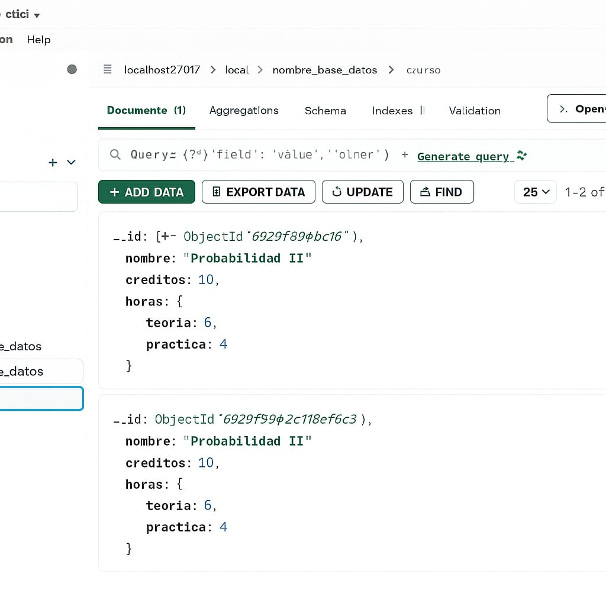

// 1. Seleccionar la base de datos
use Universidad

// 2. Insertar documentos en la colección "alumnos"
db.alumnos.insertMany([
  {
    nombre: "María López",
    edad: 22,
    carrera: "Ingeniería de Sistemas",
    notas: [4.3, 3.9, 4.6],
    direccion: { ciudad: "Bogotá", barrio: "Usaquén" }
  },
  {
    nombre: "Julián Torres",
    edad: 24,
    carrera: "Contaduría",
    notas: [3.4, 3.7, 4.1],
    direccion: { ciudad: "Medellín", barrio: "Laureles" }
  },
  {
    nombre: "Daniela Ríos",
    edad: 19,
    carrera: "Ingeniería de Sistemas",
    notas: [4.9, 4.7, 5.0],
    direccion: { ciudad: "Cali", barrio: "El Limonar" }
  }
])

// 3. Consultas básicas

// Ver todos los alumnos
db.alumnos.find().pretty()

// Buscar un alumno por nombre
db.alumnos.find({ nombre: "María López" })

// 4. Consultas con operadores

// Alumnos de 22 años o más
db.alumnos.find({ edad: { $gte: 22 } })

// Alumnos cuya carrera sea diferente a Ingeniería de Sistemas
db.alumnos.find({ carrera: { $ne: "Ingeniería de Sistemas" } })

// Alumnos con alguna nota superior a 4.6
db.alumnos.find({ notas: { $elemMatch: { $gt: 4.6 } } })

// 5. Proyección de campos

// Mostrar solo nombre y ciudad sin el _id
db.alumnos.find(
  {},
  { nombre: 1, "direccion.ciudad": 1, _id: 0 }
)

// 6. Ordenar resultados

// Ordenar alumnos por edad de mayor a menor
db.alumnos.find().sort({ edad: -1 })

// 7. Actualizar documentos

// Añadir un campo promedio a un alumno
db.alumnos.update(
  { nombre: "María López" },
  { $set: { promedio: 4.2 } }
)

// Aumentar la edad de todos los alumnos en 1
db.alumnos.update(
  {},
  { $inc: { edad: 1 } },
  { multi: true }
)

// Agregar una nueva nota al arreglo de Julián Torres
db.alumnos.update(
  { nombre: "Julián Torres" },
  { $push: { notas: 4.3 } }
)

// 8. Eliminar documentos

// Eliminar un alumno por nombre
db.alumnos.remove({ nombre: "Daniela Ríos" })

// Eliminar alumnos con promedio menor a 4
db.alumnos.remove({ promedio: { $lt: 4 } })

// 9. Crear colección "materias"
db.materias.insertMany([
  { nombre: "Gestión de Datos", creditos: 10 },
  { nombre: "Cálculo", creditos: 7 },
  { nombre: "Fundamentos de Programación", creditos: 9 }
])

// 10. Consultas entre colecciones (referencial / conceptual)

// Buscar una materia
db.materias.findOne({ nombre: "Gestión de Datos" })

// Ejemplo si existiera un campo materiasInscritas
db.alumnos.find({
  materiasInscritas: { $in: [ObjectId("ID_DE_LA_MATERIA")] }
})